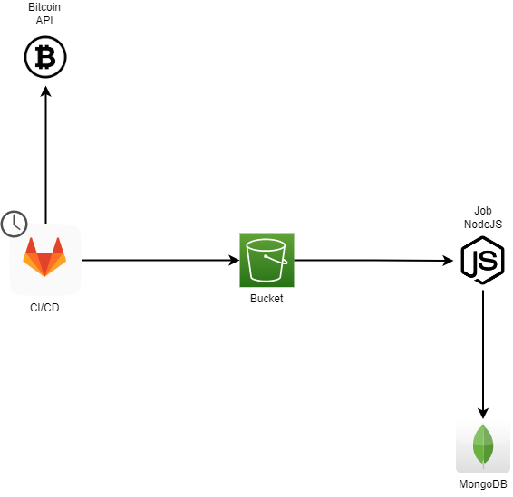

# gitlab-cicd-demo

In order to run the pipeline, set the following variables on CI/CD env:

```bash
AWS_ACCESS_KEY_ID=
AWS_SECRET_ACCESS_KEY=
AWS_REGION=sa-east-1
MONGO_URI=mongodb+srv://<user>:<password>@<host>/?maxPoolSize=1&retryWrites=true&w=majority
MONGO_DATABASE=bitcoinv2
S3_BUCKET_NAME="bitcoin-bucket-$(cat /dev/urandom | tr -dc 'a-zA-Z0-9' | fold -w 12 | tr '[:upper:]' '[:lower:]' | head -n 1)"
```

## Application architecture

